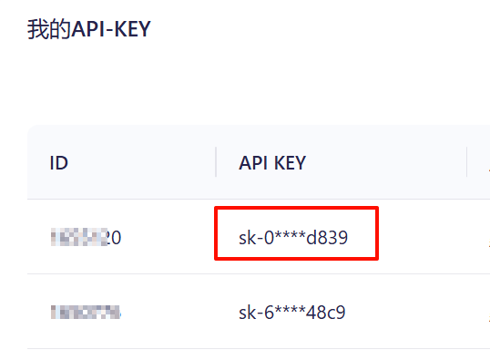
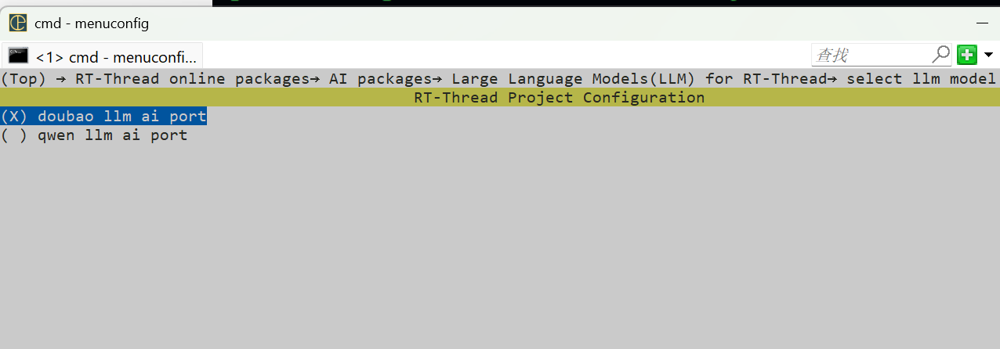
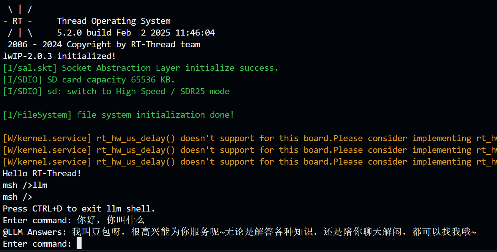

# LLM Language Model in RT-Thread

> 在 RT-Thread 上进行 LLM 大语言模型对话

## LLM平台

- [x] 通义千问
- [x] 豆包大模型

## 平台支持

- [x] qemu-a9

- [ ] STM32

## 使用方式

**首先确保您的设备可以使用正常使用网络功能**

### MSH终端交互

#### 通义千问

注册[阿里云](https://www.aliyun.com/product/bailian?spm=5176.28103460.0.0.5abc5d27J2SWgK)账号，并进入阿里云百炼平台：选择模型广场→API调用示例

新建API-KEY：

填写描述后即可创建API-KEY（SK-XXXXXXXX）:

1. 打开 menuconfig，进入 `RT-Thread online packages → AI packages → Large Language Models(LLM) for RT-Thread` 目录下；按照下图进行配置：

* llm qwen user api key：`API KEY` 需要在通义千问控制台获取；
* llm qwen model name：选择模型的名称默认是 `qwen-plus`；

2. 进入 `  RT-Thread online packages → IoT - internet of things → WebClient: A HTTP/HTTPS Client for RT-Thread` 选择`MbedTLS support`

3. 退出保存配置，输入 `pkgs --update` 拉取软件包；

4. 编译，运行；

5. 运行效果：

> 输入llm即可进入聊天终端，CTRL+D可以退出聊天窗口返回MSH终端；

#### 豆包大模型

1. 如需创建/查看API Key，请参见 [1.获取并配置 API Key ](https://www.volcengine.com/docs/82379/1399008#b00dee71)；
2. 如选创建/查看推理接入点ID，请参见 [2.创建在线推理接入点（Endpoint）](https://www.volcengine.com/docs/82379/1399008#93d221a3)
3. 打开 menuconfig，进入 `RT-Thread online packages → AI packages → Large Language Models(LLM) for RT-Thread` 目录下；
4. 选择 `doubao llm ai` 模型：

5. 输入 1、2 步骤获取到的 `API KEY` 和 `推理接入点ID`；

6.   进入 `RT-Thread online packages → security packages → mbedtls` 菜单，修改 `Maxium fragment length in bytes` 字段为 6144（否则TLS会握手失败）

7. 进入 `  RT-Thread online packages → IoT - internet of things → WebClient: A HTTP/HTTPS Client for RT-Thread` 选择`MbedTLS support`

8. 退出保存配置，输入 `pkgs --update` 拉取软件包；

9. 编译，运行；
10. 运行效果：

> 输入 llm 即可进入聊天终端，CTRL+D可以退出聊天窗口返回 MSH 终端；

